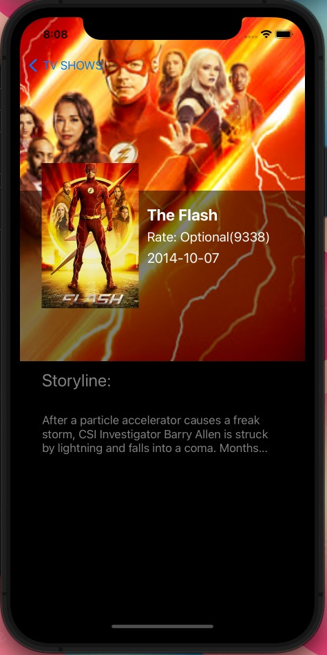

# TheMovieDB App

App creada en UIKit con arquitectura MVC.

App que muestra en un collection view un lista de peliculas usando la API: The Movie Data Base.

Las muestra con un sistema de paginación y su correspondiente navegación a una ficha de detalle.

TODOs: 

- Mejorar la UI.
- Añadir sistema de persistencia de datos

App actualmente en desarrollo.

